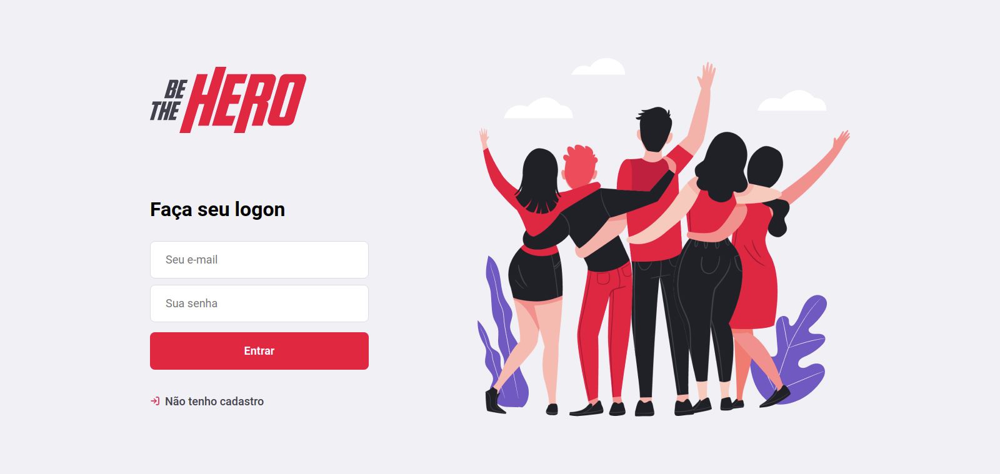

# Be the hero 

Aplicação desenvolvida na semana Omnistack11.

 Criada para ajudar a captação de recursos de Organizações não Governamentais.

## Principais tecnologias utilizadas:

- Node Js - Backend
- ReactJS - Frontend
- React Native - Mobile
- Insominia - REST client

  

